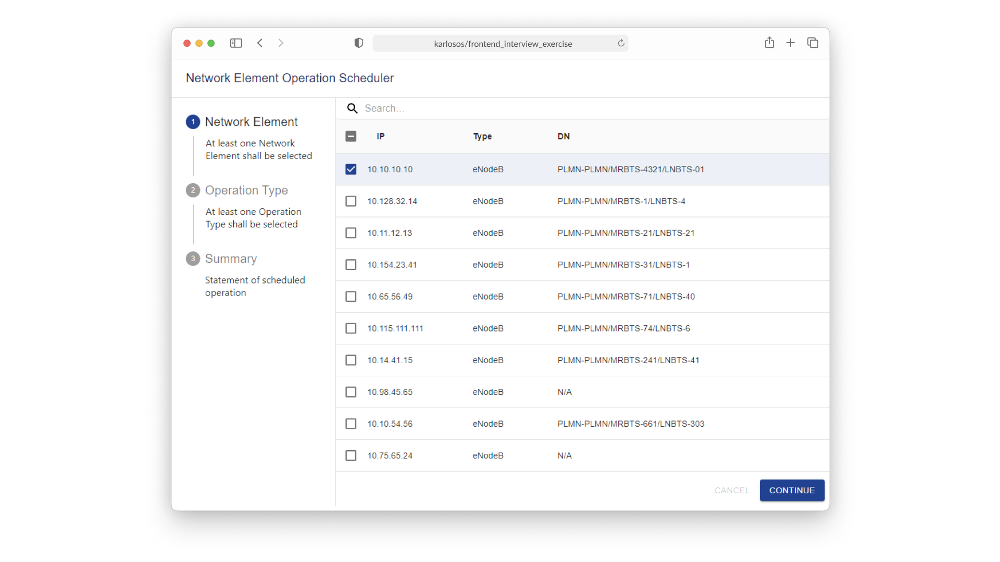

***

<h4 align="center">Frontend Engineer Interview Exercise</h4>

  <a href="#about">About</a> •
  <a href="#development">Development</a> •
  <a href="#deployment">Deployment</a>

<table>
<tbody>
<td align="center">
 
Website: <b><a href="https://karlosos.github.io/frontend-interview-exercise">karlosos.github.io/frontend-interview-exercise 🌐</a></b> 

</td>
</tbody>
</table>

## About

Frontend Engineer interview exercise. 

Simplified tasks requirements:

1. Wizard with 3 steps.
2. User can select multiple network elements and one operation type.
3. Data should be saved in Firebase database.

Technical requirements:

1. Use React
1. Manage state with Redux
1. Manage side effects with redux-saga

## Development

1. Install dependencies with `npm install`.
1. Run desktop application with `npm run start` or react app with `npm run react-start`.
1. Open [http://localhost:3000](http://localhost:3000) to view it in the browser.

### Tests

Code coverage can be checked using `npm test -- --coverage --watchAll`.

Run tests with `npm test` which launches the test runner in the interactive watch mode.

## Deployment

Application is automatically deployed to GithubPages using `.github/workflows/main.yml` workflow.
